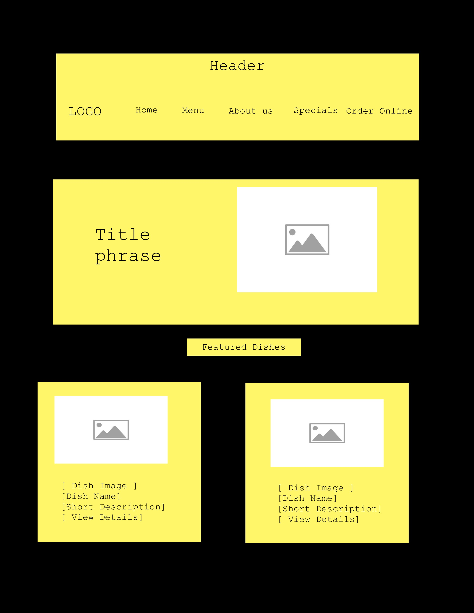
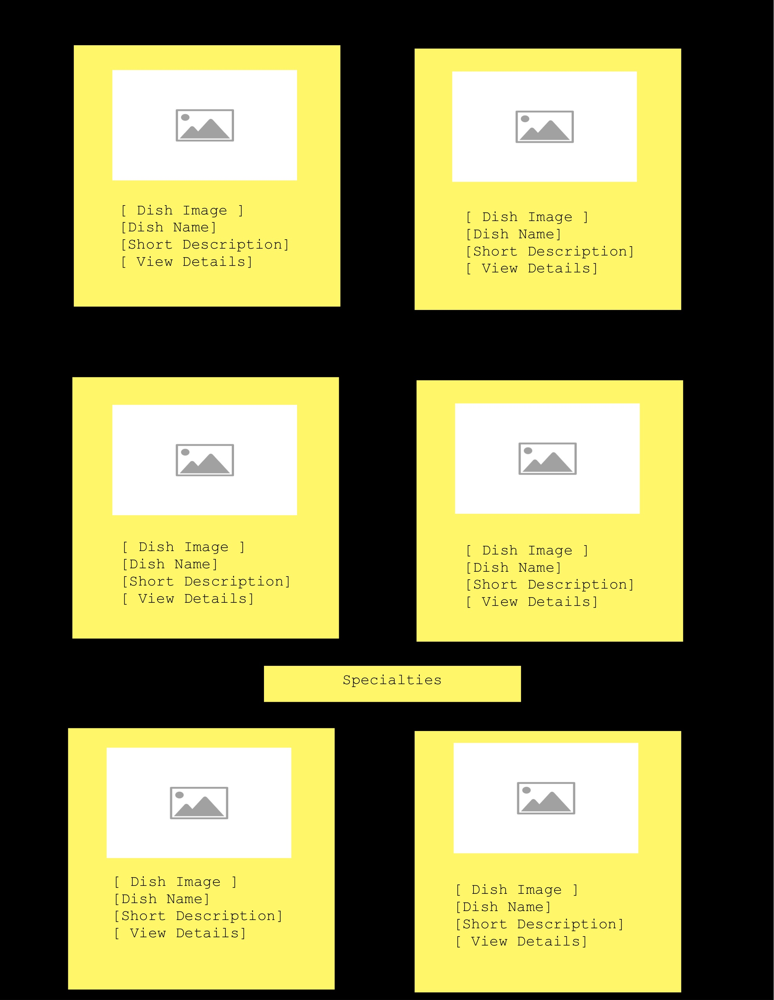
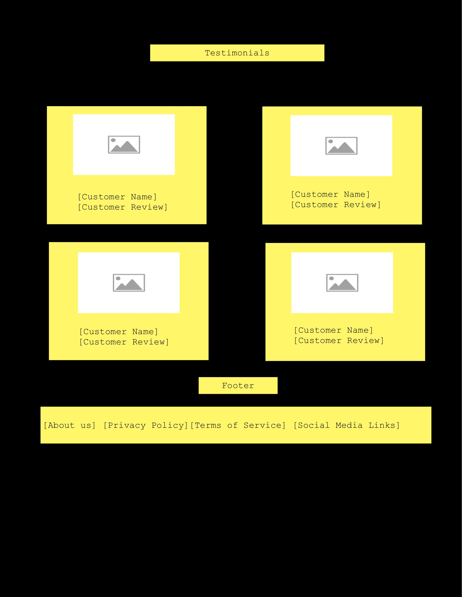

<h1 style="text-align: center;">Island Spice website</h1>

This website is for Island Spice, a restaurant specializing in Caribbean cuisine. The goal is to provide information about our menu, about, reservations, and more. Our target audience is local residents and tourists interested in authentic Caribbean flavors 🏝️.
  

<h2 style="text-align: center;">Technical Requirements </h2>

As part of the Island Spice website project, I was tasked with creating a multi-page site that includes a variety of essential elements and styling techniques. The primary objective was to develop a site with at least three distinct pages, each maintaining a consistent grid layout to ensure a cohesive visual experience.

 I incorporated a diverse range of HTML tags to structure the content effectively and included a table, two forms, and a dropdown menu to enhance functionality. For the design, I utilized inline, internal, and external CSS styling, employing various CSS selectors to target and style different elements.

 To achieve a visually appealing look, I brainstormed and found some colors that I though went good together. I applied Flexbox to add some responsiveness. Additionally, CSS animations were used to add dynamic effects to the user interface.

<h2 style="text-align: center;" > Challenges</h2>

One of the biggest challenges I faced in this assignment was incorporating the required elements while preserving my creative vision. I aimed to keep the design simple and functional, but I found myself in a creative flow, which led me to explore various design possibilities.

 Balancing the need to meet specific requirements with my desire to innovate was a key focus. Additionally, I had to ensure that all components integrated seamlessly and flowed naturally within the overall layout of the site.

<h2 style="text-align: center;" >Wireframes</h2 >

To guide the design process, I created a wireframe using the app Noteful, which helped in visualizing the layout and organizing content before diving into development.

    
    
    

<h2>Sources</h2>

<a href="https://lovesomejerk.com/index.php#premenu" target="_blank">Lovesome Jerk Menu</a> 
<a href="https://goldenkrust.com/menu/" target="_blank">Golden Krust Menu</a>
